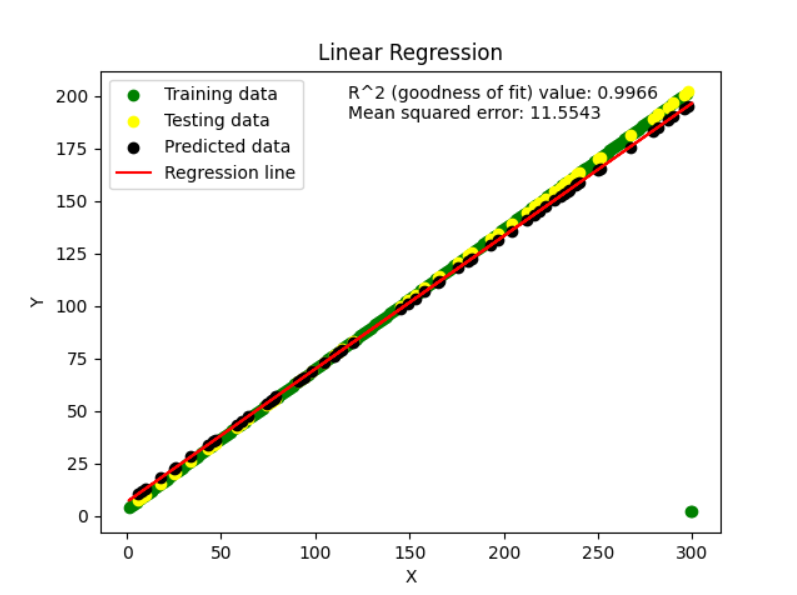
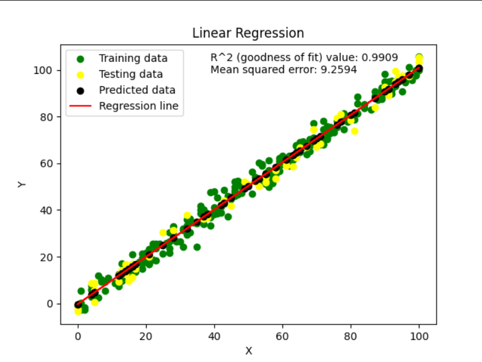

# Machine Learning Algorithms from Scratch

This repository contains implementations of fundamental machine learning algorithms from scratch, organized into three categories: supervised learning, unsupervised learning, and reinforced learning. The algorithms are implemented in Python, without relying on external libraries for the core functionality.

## Table of Contents

1. [Supervised Learning](#supervised-learning)
   - [1. Linear Regression](#1-linear-regression)
     - [1.1 Univariate Linear Regression](#11-univariate-linear-regression)
     - [1.2 Linear Regression with Gradient Descent](#12-linear-regression-with-gradient-descent)
     - [1.3 Multivariate Linear Regression](#13-multivariate-linear-regression)
2. [Unsupervised Learning](#unsupervised-learning)
3. [Reinforced Learning](#reinforced-learning)

## Supervised Learning

---
### 1. Linear Regression

#### 1.1 Uni variate Linear Regression

**Description:** Uni variate linear regression is a type of linear regression where there is only one independent variable. It models the relationship between this independent variable and a dependent variable.

**Files:**
- `linear_regression.py`: Contains the implementation of univariate linear regression.
- `Linear Regression - Sheet1.csv`: Sample dataset for training and testing the linear regression model (Dataset 1).
- `Linear Regression - Sheet2.csv`: Another sample dataset for training and testing the linear regression model (Dataset 2).

**Usage:**
1. **Dependencies:** This implementation relies on several Python libraries:
   - `numpy`: For numerical computations.
   - `pandas`: For data manipulation and preprocessing.
   - `matplotlib`: For data visualization.
   - `sklearn`: Specifically, the `model_selection` module for train-test splitting.
2. **Installation:** To install the required dependencies, run:
   ```bash
   pip install -r requirements.txt
   ```
3. **Running the Code:** Execute `linear_regression.py` to train and test the linear regression model on the provided datasets.

**Output:**
- The coefficient of determination (R^2) value and mean squared error (MSE) are printed to evaluate the performance of the model.
- A scatter plot is generated to visualize the training and testing data points, along with the regression line and predicted data points.
- For test set 1
- 
- For test set 2
- 
#### 1.2 Linear Regression with Gradient Descent

#### 1.3 Multivariate Linear Regression


---

## Unsupervised Learning

_(Coming soon...)_

---

## Reinforced Learning

_(Coming soon...)_

---