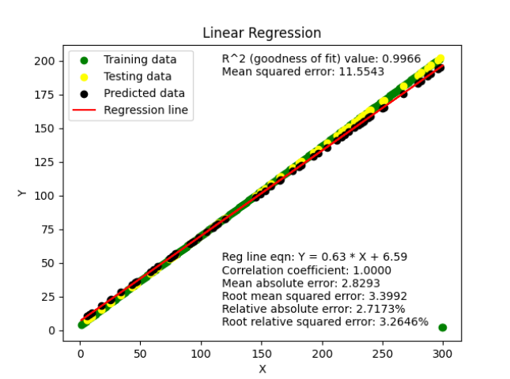
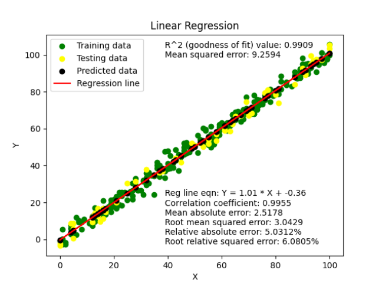
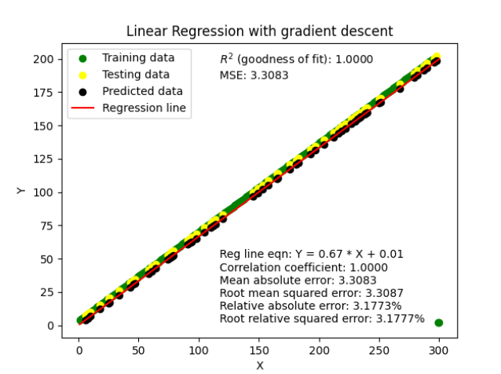
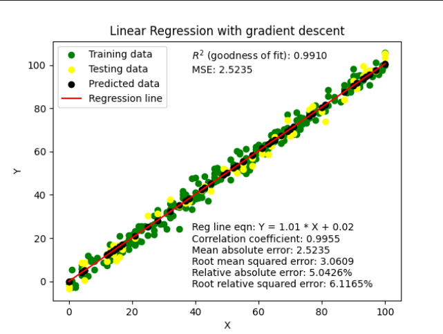
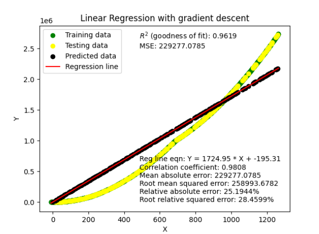
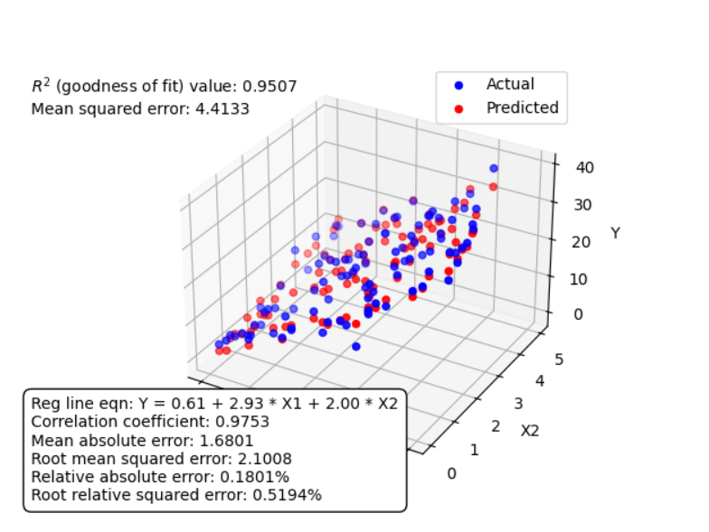
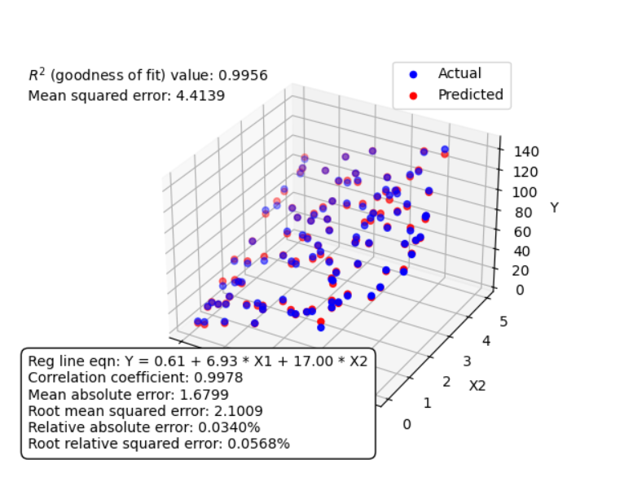
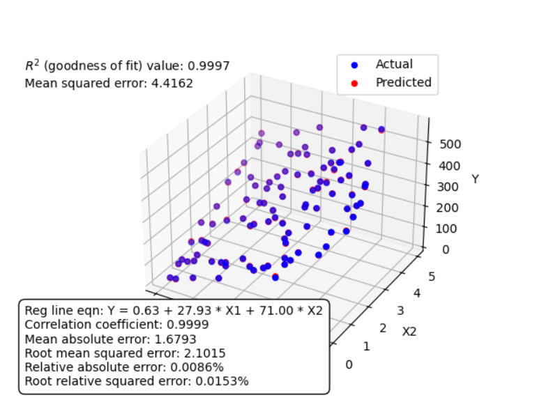

# Linear Regression

---
## 1.1 Uni variate Linear Regression

**Description:** Uni variate linear regression is a type of linear regression where there is only one independent variable. It models the relationship between this independent variable and a dependent variable.

**Files:**
- `Uni Variate Linear Regression.py`: Contains the implementation of uni variate linear regression.
- `Linear Regression - Sheet1.csv`: Sample dataset for training and testing the uni variate linear regression model (Dataset 1).
- `Linear Regression - Sheet2.csv`: Another sample dataset for training and testing the uni variate linear regression model (Dataset 2).
- `Linear Regression - Sheet23.csv`: Another sample dataset for training and testing the uni variate linear regression model (Dataset 3).

**Usage:**
1. **Dependencies:** This implementation relies on several Python libraries:
   - `numpy`: For numerical computations.
   - `pandas`: For data manipulation and preprocessing.
   - `matplotlib`: For data visualization.
   - `sklearn`: Specifically, the `model_selection` module for train-test splitting.
   
2. **Running the Code:** Execute `Uni Variate Linear Regression.py` to train and test the linear regression model on the provided datasets.

**Output:**
- The coefficient of determination (R^2) value and mean squared error (MSE) are printed to evaluate the performance of the model.
- A scatter plot is generated to visualize the training and testing data points, along with the regression line and predicted data points.
- For test set 1
- 
- For test set 2
- 
- For test 3
- 

---
### 1.2 Linear Regression with Gradient Descent
**Description:** Linear regression with gradient descent is an optimization algorithm used to find the optimal parameters (slope and intercept) of a linear regression model by minimizing the cost function iteratively.

**Files:**
- `Linear Regression with Gradient Descent .py`: Contains the implementation of linear regression using gradient descent.
- `Linear Regression - Sheet1.csv`: Sample dataset for training and testing the linear regression model (Dataset 1).
- `Linear Regression - Sheet2.csv`: Another sample dataset for training and testing the linear regression model (Dataset 2).
- `Linear Regression - Sheet3.csv`: Another sample dataset for training and testing the linear regression model (Dataset 3).

**Usage:**
1. **Dependencies:** This implementation relies on several Python libraries:
   - `numpy`: For numerical computations.
   - `pandas`: For data manipulation and preprocessing.
   - `matplotlib`: For data visualization.
   - `sklearn`: Specifically, the `model_selection` module for train-test splitting.

2. **Running the Code:** Execute `Linear Regression with Gradient Descent .py` to train and test the linear regression model using gradient descent on the provided datasets.

**Output:**
- The learned parameters (slope and intercept) of the regression line are printed.
- Evaluation metrics including the coefficient of determination (R^2), mean absolute error, root mean squared error, relative absolute error, and root relative squared error are calculated and printed to evaluate the performance of the model.
- A scatter plot is generated to visualize the training and testing data points, along with the regression line and predicted data points.
- For test set 1
- 
- For test set 2
- 
- For test set 3
- 

---
## 1.3 Multivariate Linear Regression
**Description:** Multivariate linear regression is a type of linear regression where there are multiple independent variables. It models the relationship between these independent variables and a dependent variable.

**Files:**
- `Multi Variate Linear Regression.py`: Contains the implementation of multivariate linear regression.
- `Multi Variate Linear Regression - Sheet1.csv`: Sample dataset for training and testing the multivariate linear regression model (Dataset 1).
- `Multi Variate Linear Regression - Sheet2.csv`: Another sample dataset for training and testing the multivariate linear regression model (Dataset 2).
- `Multi Variate Linear Regression - Sheet3.csv`: Another sample dataset for training and testing the multivariate linear regression model (Dataset 3).

**Usage:**
1. **Dependencies:** This implementation relies on several Python libraries:
   - `numpy`: For numerical computations.
   - `pandas`: For data manipulation and preprocessing.
   - `matplotlib`: For data visualization.
   - `sklearn`: Specifically, the `model_selection` module for train-test splitting.

2. **Running the Code:** Execute `Multi Variate Linear Regression.py` to train and test the multivariate linear regression model on the provided datasets.

**Output:**
- The learned parameters (coefficients) of the regression line are printed.
- Evaluation metrics including the correlation coefficient, mean absolute error, root mean squared error, relative absolute error, root relative squared error, and coefficient of determination (R^2) are calculated and printed to evaluate the performance of the model.
- A 3D scatter plot is generated to visualize the actual vs. predicted values, along with the regression plane.
- For test 1
- 
- For test 2
- 
- For test 3
- 