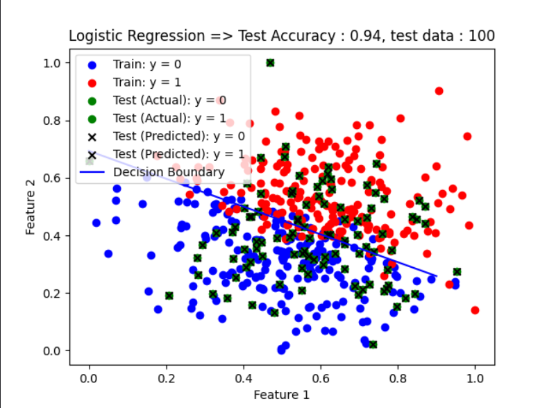
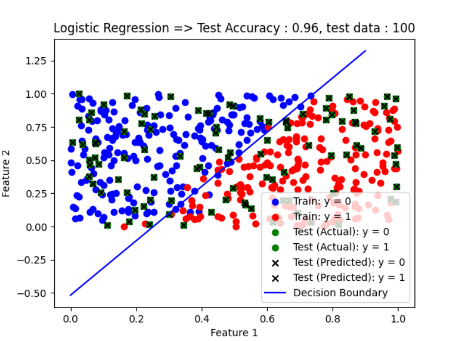
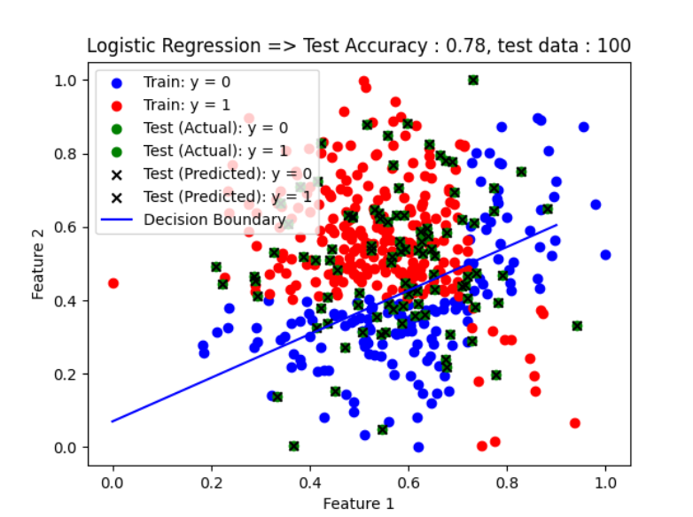

# Logistic Regression

**Description:**
Logistic regression is a supervised learning algorithm used for binary classification tasks. It models the probability that a given input belongs to a particular class. Unlike linear regression, which predicts continuous values, logistic regression predicts the probability of a binary outcome based on one or more independent variables.

**Files:**
- `Logistic_Regression.py`: Contains the implementation of logistic regression.
- `Logistic Regression - Sheet1.csv`: Sample dataset for training and testing the logistic regression model (Dataset 1).
- `Logistic Regression - Sheet2.csv`: Another sample dataset for training and testing the logistic regression model (Dataset 2).
- `Logistic Regression - Sheet3.csv`: Another sample dataset for training and testing the logistic regression model (Dataset 3).

**Usage:**
1. **Dependencies:**
   - `numpy`: For numerical computations.
   - `pandas`: For data manipulation and preprocessing.
   - `matplotlib.pyplot`: For data visualization.
   - `sklearn.model_selection.train_test_split`: For splitting the dataset into train and test sets.
   - `sklearn.metrics.accuracy_score`: For evaluating the model's accuracy.

2. **Running the Code:**
   Execute `Logistic_Regression.py` to train and test the logistic regression model on the provided datasets.

**Output:**
- The test accuracy of the model is printed, along with the number of test data points and the number of correctly predicted labels.
- A scatter plot is generated to visualize the training and testing data points, along with the decision boundary and predicted data points.
- For test 1
- 
- For test 2
- 
- For test 3
- 

---